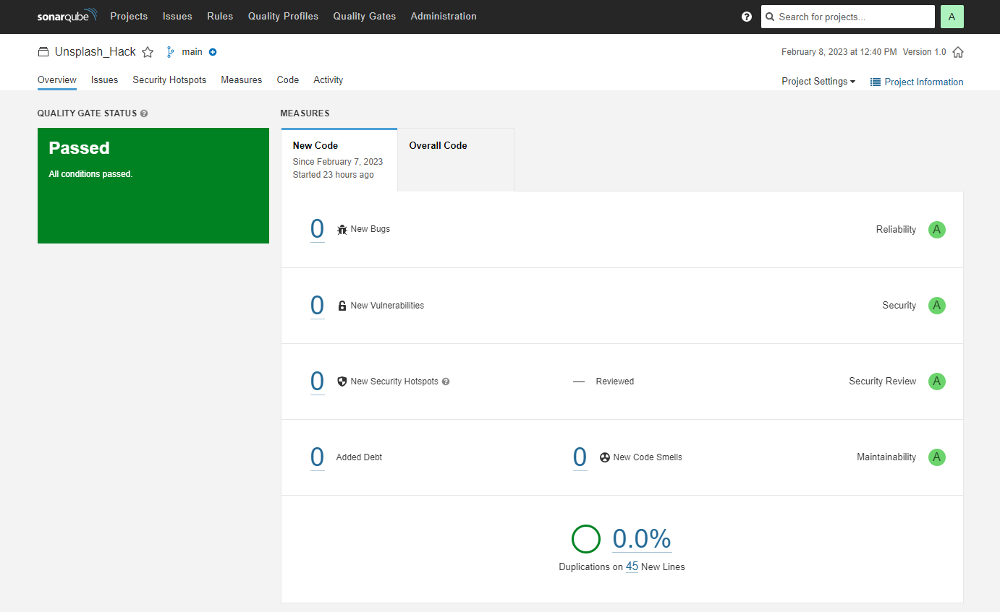

# UnsplashApp

Una aplicación que recopila la información de Unsplash para mostrar las fotos que el usuario desee y poder visualizarlo sin problemas. Consta de un buscador y una paginación para que sea mas fácil la busqueda.

La página web es sencilla, todo pasa en una sola página para que no se carguen tantas cosas y la velocidad de carga sea mas rápida.


## Framework
---

Para armar toda la aplicación utilizo Angular porque tiene una buena estructura y buena documentación que ayudan a que un proyecto grande en el futuro continue sin problemas por si quieres actualizar el código o añadir mas funcionalidades puedes hacerlo sin repetir tanto código.

> Este proyecto fue generado con [Angular CLI](https://github.com/angular/angular-cli) version 15.0.0.

## Estructura
---

He pensado en hacer la estructura de la página muy parecida a otras plataformas de fotografías para que el usuario se sienta familiarizado, también lo he hecho pensando en la usabilidad y la facilidad a la hora de navegar por la página ya que es muy sencilla.


## Maquetación
---

Una vez hecha la estructura puse el código en marcha junto con la llama a la api de Unsplash para asegurarme de que todo corre bien y no tener problemas luego de haber maquetado y diseñado toda la página. Me decanté por usar las librerías de NgMaterial y PrimeNg para diseñar mas rápido. Utilizo Primeflex sobretodo para el diseño responsive y NgMaterial para implementar algunas funcionalidades ya que luego personalizarlas es mucho mas sencillo y cómodo que PrimeNg.


> Este proyecto usa [Prime Ng](https://primeng.org/) y [Angular Material](https://material.angular.io//) para el diseño.

*He creado una carpeta de librerías para poder añadir mas funcionalidades de dichas librerias a la página mediante un módulo si se requiere.*

## Código
---

El código de llamada a la api de Unsplash esta en un servicio para que sea más fácil de llamar esa funcion en otros componentes que lo requieran, aunque en este caso solo hay una página y no es necesario, esta pensado para cuando la aplicación crezca.

**Asi es como llamamos al servicio desde el componente de home para obtener las imágenes**

```typescript

  ngOnInit() {

    this.imgsrv.getRandomImg()
    this.imgsrv.getImgRandom().subscribe((r:any)=>{
      this.bgImg = {
        'background-image': `url(${r})`,
      }
    })
    
    this.imgsrv.getImages(1)
    this.imgsrv.getNumOfPages().subscribe((res:any)=>{
      this.totalPages = res      
    })
    
    this.imgsrv.getImgRegular().subscribe((res:any) => {
      this.imgRegular = res
    })    

  }

```


## Reconocimientos

* [Unsplash]('https://unsplash.com/developers)

## Sonarqube
Estos son los resultados del escaner de Sonarqube



## Contact info

* tel: 608880686
* correo: henryrivera.frontend@gmail.com


